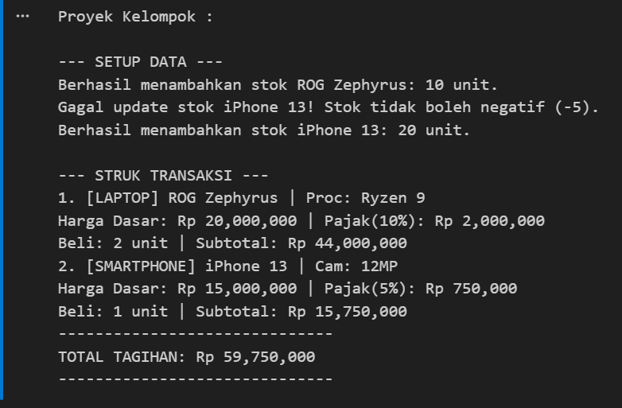

# 🤖 Artificial Intelligence & OOP — Praktikum 1-6

Repositori ini berisi kumpulan proyek praktikum mata pelajaran **Pemrograman Berorientasi Objek (OOP)** menggunakan Python, dengan tema simulasi dunia game dan sistem belanja elektronik.

---

## 📁 Daftar Proyek

| File | Topik | Deskripsi |
|------|-------|-----------|
| `ProyekSatu.ipynb` | **Class & Object** | Membuat class `Hero` dengan atribut `name`, `hp`, dan `attack_power`, lalu menampilkan info hero |
| `ProyekDua.ipynb` | **Method & Interaksi Objek** | Simulasi pertarungan antar hero menggunakan method `serang()` dan `diserang()` |
| `ProyekTiga.ipynb` | **Inheritance** | Class `Mage` mewarisi class `Hero`, menambahkan atribut `mana` dan skill `fireball` |
| `ProyekEmpat.ipynb` | **Encapsulation** | Menggunakan private variable (`__hp`) dengan getter/setter bervalidasi untuk mencegah cheat |
| `ProyekLima.ipynb` | **Abstraction** | Membuat abstract class `GameUnit` sebagai blueprint untuk `Hero` dan `Monster` |
| `ProyekEnam.ipynb` | **Polymorphism** | Beberapa subclass (`Mage`, `Archer`, `Fighter`, `Healer`) meng-override method `serang()` |
| `ProyekKelompok.ipynb` | **Full OOP (Proyek Akhir)** | Sistem toko elektronik dengan `Laptop` & `Smartphone`, keranjang belanja, dan struk transaksi |

---

## 📸 Hasil Output

### Proyek 1 — Class & Object


### Proyek 2 — Method & Interaksi Objek


### Proyek 3 — Inheritance


### Proyek 4 — Encapsulation


### Proyek 5 — Abstraction


### Proyek 6 — Polymorphism


### Proyek Kelompok — Full OOP (Toko Elektronik)


---

## 🧠 Konsep OOP yang Dipelajari

- **Class & Object** — Cetak biru dan instansiasi objek
- **Encapsulation** — Private attribute dengan getter/setter
- **Inheritance** — Pewarisan sifat dari class induk ke class anak
- **Polymorphism** — Satu method, banyak bentuk perilaku
- **Abstraction** — Abstract class sebagai kontrak/blueprint

---

## 🛠️ Tools & Requirements

- Python 3.12+
- Jupyter Notebook / VS Code with Jupyter extension
- Library: `abc` (built-in)

---

## 🚀 Cara Menjalankan

1. Clone repositori ini:
   ```bash
   git clone https://github.com/ChristianImmanuel2009/Artificial-Intelligence_OOP.git
   ```
2. Buka folder di VS Code atau Jupyter Notebook
3. Jalankan setiap file `.ipynb` secara berurutan (Proyek Satu → Kelompok)

---

## 👤 Author

**Christian Immanuel**
XI RPL 7 — SMK Telkom
Mata Pelajaran: Kecerdasan Buatan (AI) / Pemrograman OOP
Guru Pembimbing: Pak Arifin
